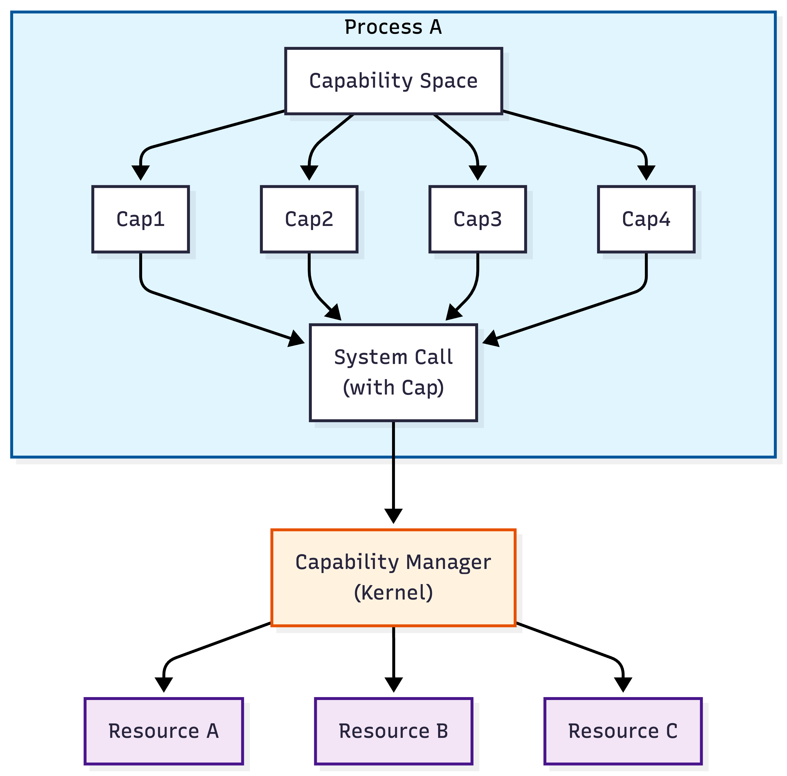

# Ferrous Kernel - Capability System Design

**Version:** 0.1  
**Date:** 2026-01-04  
**Status:** Design Phase (Phase 0)

---

## Overview

This document describes the capability-based security system for Ferrous Kernel. The capability system provides access control, resource authorization, and fine-grained permission management without ambient authority.

**Related Documents:**
- [ARCHITECTURE.md](ARCHITECTURE.md) - System architecture overview
- [CHARTER.md](CHARTER.md) - Design principles and security model
- [ROADMAP.md](ROADMAP.md) - Development phases

---

## Design Goals

### Primary Goals

1. **No Ambient Authority** - All access requires explicit capability
2. **Unforgeable** - Capabilities cannot be guessed or forged
3. **Delegatable** - Capabilities can be transferred and derived
4. **Revocable** - Capabilities can be revoked at any time
5. **Auditable** - All capability operations are logged

### Security Principles

- **Principle of Least Privilege**: Processes receive minimal necessary capabilities
- **Explicit Authorization**: No implicit or default permissions
- **Composability**: Complex permissions built from simple capabilities
- **Transparency**: Capability operations are observable and traceable

---

## Core Concepts

### What is a Capability?

A **capability** is an unforgeable token that grants access to a resource or permits an operation. In Ferrous:

- Capabilities are **opaque tokens** (cryptographically secure identifiers)
- Capabilities **cannot be forged** or guessed
- Capabilities are **transferable** through IPC
- Capabilities can be **derived** with restrictions
- Capabilities can be **revoked** by the issuer

### Capability vs. Permission

- **Permission**: A right to perform an action (abstract concept)
- **Capability**: A concrete, unforgeable token representing a permission (implementation)

In Ferrous, we use capabilities as the only mechanism for authorization.

---

## Architecture Overview



---

## Core Abstractions

### Capability

An opaque capability token. The internal representation is an implementation detail, but capabilities are:

- **Cryptographically secure**: Cannot be guessed or forged
- **Unique**: Each capability has a unique identifier
- **Opaque**: User-space cannot inspect capability internals
- **Non-forgeable**: Only the kernel can create capabilities

**Rust Interface (conceptual)**:
```rust
/// Opaque capability handle
#[derive(Debug, Clone, Copy, PartialEq, Eq, Hash)]
pub struct Capability {
    // Internal: cryptographically secure identifier
    id: CapabilityId,
    // Internal: generation number for revocation
    generation: u64,
}

impl Capability {
    /// Check if capability is valid (not revoked)
    pub fn is_valid(&self) -> bool {
        // Kernel-only: check generation number
    }
}
```

### CapabilityId

The internal identifier for a capability. Implementation options:

**Option 1: Cryptographic Hash**
- Generate random 128-bit identifier
- Store in kernel capability table
- Fast lookup, secure

**Option 2: Index + Secret**
- Index into capability table + per-capability secret
- Smaller representation (64-bit)
- Requires table lookup

**Phase 2 Decision**: Start with Option 1 (cryptographic hash) for simplicity and security.

### CapabilitySpace

Per-process capability table. Each process has a capability space that holds all capabilities it possesses.

**Structure**:
- Table indexed by capability slot number
- User-space references capabilities by slot number (handle)
- Kernel translates slot → capability ID
- Slot numbers are process-local (not global)

**Rust Interface (conceptual)**:
```rust
pub struct CapabilitySpace {
    // Capability table: slot → Capability
    capabilities: Vec<Option<Capability>>,
    // Free slot list for reuse
    free_slots: Vec<usize>,
    // Process ID (for auditing)
    process_id: ProcessId,
}

impl CapabilitySpace {
    /// Create new empty capability space
    pub fn new(process_id: ProcessId) -> Self { /* ... */ }
    
    /// Insert capability, return slot number
    pub fn insert(&mut self, cap: Capability) -> CapabilitySlot {
        // Allocate slot (reuse free slot or append)
        // Store capability
        // Return slot number
    }
    
    /// Get capability by slot number
    pub fn get(&self, slot: CapabilitySlot) -> Option<&Capability> {
        // Bounds check
        // Return capability if slot is valid
    }
    
    /// Remove capability from slot
    pub fn remove(&mut self, slot: CapabilitySlot) -> Option<Capability> {
        // Remove capability
        // Mark slot as free
    }
}
```

### CapabilitySlot

User-space handle for a capability (slot number in capability space).

```rust
/// User-space capability handle (slot number)
#[derive(Debug, Clone, Copy, PartialEq, Eq, Hash)]
pub struct CapabilitySlot(pub usize);
```

---

## Capability Types

Ferrous supports several types of capabilities, each granting access to different resources:

### 1. Object Capabilities

Grant access to specific kernel objects (endpoints, files, devices, memory regions).

**Examples**:
- **Endpoint Capability**: Send/receive messages on an IPC endpoint
- **Memory Capability**: Map/unmap a memory region
- **Device Capability**: Access a hardware device (MMIO/PIO)
- **File Capability**: Read/write a file (future)

**Structure**:
```rust
pub enum ObjectCapability {
    Endpoint { endpoint_id: EndpointId, permissions: EndpointPerms },
    Memory { region_id: MemoryRegionId, permissions: MemoryPerms },
    Device { device_id: DeviceId, permissions: DevicePerms },
    // ...
}
```

### 2. Process Capabilities

Control process lifecycle and attributes.

**Examples**:
- **Kill Capability**: Terminate a process
- **Suspend Capability**: Suspend/resume a process
- **Migrate Capability**: Move process to different resource group
- **Debug Capability**: Attach debugger, read memory

**Structure**:
```rust
pub enum ProcessCapability {
    Kill { target_process: ProcessId },
    Suspend { target_process: ProcessId },
    Debug { target_process: ProcessId },
    // ...
}
```

### 3. System Capabilities

Grant system-wide privileges (create resources, manage resource groups).

**Examples**:
- **Create Endpoint**: Create new IPC endpoints
- **Create Resource Group**: Create new resource groups
- **Allocate Memory**: Allocate physical memory
- **Manage Services**: Start/stop system services

**Structure**:
```rust
pub enum SystemCapability {
    CreateEndpoint,
    CreateResourceGroup,
    AllocateMemory { limit: usize },
    ManageServices,
    // ...
}
```

### 4. Derived Capabilities

Restricted subsets of parent capabilities.

**Examples**:
- Full filesystem capability → read-only capability for specific directory
- Full memory capability → capability for specific memory region
- Endpoint capability → send-only or receive-only capability

**Derivation Rules**:
- Derived capabilities have **fewer** permissions than parent
- Revoking parent capability invalidates all derived capabilities
- Derivation chain is tracked for revocation

---

## Capability Operations

### Grant (Transfer)

Transfer a capability from one process to another via IPC.

**Security Properties**:
- Only the holder can grant their capability
- Grant operation is explicit and logged
- Receiver's capability space must have space

**Process**:
1. Sender validates capability slot is valid
2. Kernel removes capability from sender's space
3. Kernel inserts capability into receiver's space
4. Generate observability event

**System Call**:
```rust
/// Grant capability to another process
fn grant(
    cap_slot: CapabilitySlot,      // Capability to grant
    target_process: ProcessId,     // Target process
    target_slot: Option<CapabilitySlot>, // Optional target slot
) -> Result<CapabilitySlot, CapabilityError>
```

### Derive (Restrict)

Create a new capability with fewer permissions than the parent.

**Security Properties**:
- Derived capability has subset of parent permissions
- Revoking parent invalidates derived capability
- Derivation chain is tracked

**Process**:
1. Validate parent capability
2. Check derivation rules (can this type be derived?)
3. Create new capability with restricted permissions
4. Link derived capability to parent (for revocation)

**System Call**:
```rust
/// Derive a restricted capability
fn derive(
    parent_slot: CapabilitySlot,
    restrictions: CapabilityRestrictions,
) -> Result<CapabilitySlot, CapabilityError>
```

### Revoke

Invalidate a capability, making it unusable.

**Security Properties**:
- Revocation is immediate (or lazy with generation numbers)
- All derived capabilities are also revoked
- Observability events generated

**Revocation Strategies**:

**Option 1: Immediate Revocation**
- Remove capability from all capability spaces
- Fast lookup required (revocation list)
- Complex when capability is in many spaces

**Option 2: Generation Numbers (Lazy)**
- Each capability has a generation number
- Revocation increments generation in kernel table
- Capability checks compare generation numbers
- Cleanup happens lazily

**Phase 2 Decision**: Start with Option 2 (generation numbers) for simplicity.

**Process**:
1. Increment generation number in kernel capability table
2. Mark capability as revoked
3. Invalidate all derived capabilities (recursive)
4. Generate observability events

**System Call**:
```rust
/// Revoke a capability
fn revoke(cap_slot: CapabilitySlot) -> Result<(), CapabilityError>
```

---

## Capability Validation

### Validation Process

When a system call requires a capability:

1. **Lookup**: Kernel translates slot → capability ID
2. **Validate**: Check capability is valid (not revoked)
3. **Authorize**: Check capability type and permissions match operation
4. **Execute**: Perform operation if authorized
5. **Audit**: Generate observability event

### Authorization Rules

**Endpoint Operations**:
- `send()` requires endpoint capability with SEND permission
- `receive()` requires endpoint capability with RECEIVE permission
- `create_endpoint()` requires CREATE_ENDPOINT system capability

**Memory Operations**:
- `map()` requires memory capability with MAP permission
- `unmap()` requires memory capability for the region
- `allocate_memory()` requires ALLOCATE_MEMORY system capability

**Process Operations**:
- `kill()` requires process capability with KILL permission
- `spawn()` requires SPAWN_PROCESS system capability

---

## Security Guarantees

### Unforgeability

**Guarantees**:
- Capabilities are created only by the kernel
- Capability IDs are cryptographically secure (random 128-bit values)
- User-space cannot create valid capabilities
- Capability validation happens in kernel (cannot be bypassed)

### Isolation

**Guarantees**:
- Processes cannot access capabilities they don't possess
- Capability spaces are process-local (isolated)
- No global "root" user or ambient authority

### Revocation

**Guarantees**:
- Revocation is always possible (if you have the capability)
- Revocation is immediate or eventual (depending on strategy)
- Derived capabilities are invalidated when parent is revoked

### Auditability

**Guarantees**:
- All capability operations generate observability events
- Capability grants/revocations are logged
- Authorization failures are logged
- Capability usage can be traced

---

## Implementation Details

### Kernel Capability Table

Global kernel table mapping capability ID → capability metadata.

**Structure**:
```rust
struct CapabilityMetadata {
    id: CapabilityId,
    generation: u64,              // For revocation
    cap_type: CapabilityType,
    permissions: Permissions,
    parent: Option<CapabilityId>, // For derived capabilities
    created_by: ProcessId,
    created_at: Timestamp,
}
```

**Operations**:
- `create()`: Generate new capability, insert into table
- `validate()`: Check capability exists and generation matches
- `revoke()`: Increment generation, mark as revoked
- `get_metadata()`: Retrieve capability metadata

### Capability Space Management

**Per-Process Storage**:
- Capability space stored in process structure
- Slots are process-local indices
- Kernel maintains capability ID → slot mappings

**Memory Efficiency**:
- Sparse capability spaces (not all slots used)
- Free slot tracking for reuse
- Compact representation (slots are indices)

---

## System Call Interface

### Core Capability System Calls

```rust
/// Create a new capability (system capabilities only)
fn create_capability(
    cap_type: SystemCapabilityType,
) -> Result<CapabilitySlot, CapabilityError>

/// Grant capability to another process
fn grant_capability(
    cap_slot: CapabilitySlot,
    target_process: ProcessId,
) -> Result<CapabilitySlot, CapabilityError>

/// Derive a restricted capability
fn derive_capability(
    parent_slot: CapabilitySlot,
    restrictions: CapabilityRestrictions,
) -> Result<CapabilitySlot, CapabilityError>

/// Revoke a capability
fn revoke_capability(
    cap_slot: CapabilitySlot,
) -> Result<(), CapabilityError>

/// Query capability information (metadata only, no internals)
fn query_capability(
    cap_slot: CapabilitySlot,
) -> Result<CapabilityInfo, CapabilityError>
```

---

## Error Handling

### Capability Errors

```rust
#[derive(Debug)]
pub enum CapabilityError {
    InvalidSlot,           // Slot number is invalid
    CapabilityNotFound,    // Capability doesn't exist
    CapabilityRevoked,     // Capability was revoked
    InsufficientPermissions, // Capability lacks required permissions
    InvalidDerivation,     // Cannot derive capability with restrictions
    CapabilitySpaceFull,   // No slots available
    InvalidTarget,         // Target process/slot is invalid
}
```

---

## Observability

### Capability Events

**Event Types**:
- **Capability Created**: New capability created, type, creator
- **Capability Granted**: Capability transferred, sender, receiver
- **Capability Derived**: New capability derived, parent, restrictions
- **Capability Revoked**: Capability revoked, revoker, affected processes
- **Authorization Check**: Capability checked, operation, result
- **Authorization Denied**: Access denied, capability, operation, reason

**Causality Tracking**:
- Link capability operations to syscalls
- Track capability derivation chains
- Attribute capability usage to processes

---

## Boot-Time Capability Setup

### Initial Process Capabilities

The init process (first user-space process) receives initial capabilities:

- **Create Endpoint**: To create IPC endpoints
- **Create Resource Group**: To create resource groups
- **Allocate Memory**: Limited memory allocation capability
- **Spawn Process**: To create child processes

**Bootstrap Process**:
1. Kernel creates init process
2. Kernel grants initial system capabilities to init
3. Init process uses capabilities to set up system
4. Init delegates capabilities to child processes as needed

---

## Implementation Phases

### Phase 2: Foundation

**Deliverables**:
- Basic capability types (object, process, system)
- Capability space per process
- Grant/revoke operations
- Capability validation in system calls

**Success Criteria**:
- Processes can hold capabilities
- Capabilities can be granted via IPC
- System calls check capabilities before operations
- No operation succeeds without required capability

### Phase 3: Advanced Features

**Deliverables**:
- Capability derivation with restrictions
- Revocation with generation numbers
- Derived capability invalidation
- Capability delegation chains

**Success Criteria**:
- Capabilities can be derived with restrictions
- Revocation works correctly
- Derived capabilities invalidated when parent revoked

### Phase 4: Resource Groups

**Deliverables**:
- Resource group capabilities
- Capability-based resource limits
- Per-group capability spaces (future)

---

## Future Considerations

### Potential Enhancements

1. **Capability Namespaces**: Hierarchical capability organization
2. **Capability Expiration**: Time-limited capabilities
3. **Capability Delegation Policies**: Automatic delegation rules
4. **Formal Verification**: Prove capability model security properties
5. **Capability Sealing**: Prevent further derivation

---

## Related Documents

- [ARCHITECTURE.md](ARCHITECTURE.md) - System architecture overview
- [IPC_ARCHITECTURE.md](IPC_ARCHITECTURE.md) - IPC mechanism (capability transfer)
- [CHARTER.md](CHARTER.md) - Security model principles

---

**Document Status**: This is a living document. As implementation progresses, details will be refined and documented in ADRs.

