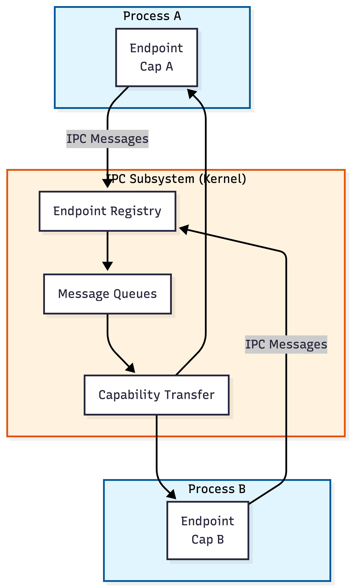

# Ferrous Kernel - IPC Architecture

**Version:** 0.1  
**Date:** 2026-01-04  
**Status:** Design Phase (Phase 0)

---

## Overview

This document describes the Inter-Process Communication (IPC) mechanism for Ferrous Kernel. IPC enables message passing between isolated processes and is the primary communication mechanism in the microkernel-inspired design.

**Related Documents:**
- [ARCHITECTURE.md](ARCHITECTURE.md) - System architecture overview
- [CAPABILITY_SYSTEM.md](CAPABILITY_SYSTEM.md) - Capability-based security (IPC authorization)
- [CHARTER.md](CHARTER.md) - Design principles

---

## Design Goals

### Primary Goals

1. **Message Passing First** - IPC is the primary communication mechanism
2. **Zero-Copy Where Possible** - Minimize data copying for performance
3. **Capability-Based** - All IPC operations require capabilities
4. **Causality Tracking** - Enable observability and request tracing
5. **Type Safety** - Leverage Rust's type system for safe message passing

### Design Principles

- **Explicit Communication**: No hidden data sharing between processes
- **Synchronous by Default**: Blocking operations are the norm (async optional)
- **Error Handling**: Explicit errors, no silent failures
- **Observability**: All IPC operations generate events

---

## Architecture Overview



---

## Core Abstractions

### Endpoint

An endpoint is a communication channel endpoint, similar to a socket or port. Each endpoint has:

- **Unique ID**: Kernel-assigned identifier
- **Owner Process**: Process that created the endpoint
- **Message Queue**: Queue of pending messages
- **State**: Connected, disconnected, closed

**Properties**:
- Endpoints are created by processes (requires capability)
- Endpoints can be connected to form bidirectional channels
- Messages are sent to endpoints (not directly to processes)
- Endpoints can be granted to other processes via capabilities

**Rust Interface (conceptual)**:
```rust
pub struct Endpoint {
    id: EndpointId,
    owner: ProcessId,
    state: EndpointState,
    message_queue: MessageQueue,
    // ...
}

#[derive(Debug, Clone, Copy, PartialEq, Eq)]
pub enum EndpointState {
    Unconnected,
    Connected { peer: EndpointId },
    Closed,
}
```

### EndpointId

Unique identifier for an endpoint (kernel-assigned).

```rust
#[derive(Debug, Clone, Copy, PartialEq, Eq, Hash)]
pub struct EndpointId(u64);
```

### Channel

A bidirectional communication channel formed by connecting two endpoints.

**Properties**:
- Channels are symmetric (both endpoints can send/receive)
- Channels are created by connecting two endpoints
- Messages flow in both directions independently
- Channels can be closed by either endpoint

**Creation**:
1. Process A creates endpoint E1
2. Process B creates endpoint E2
3. Process A grants E1 capability to Process B (or vice versa)
4. Either process calls `connect(E1, E2)` to form channel
5. Kernel links endpoints, channel is established

---

## Message Passing Model

### Message Structure

Messages are typed, structured data with optional capability transfers.

**Rust Interface (conceptual)**:
```rust
pub struct Message {
    /// Message type identifier (for deserialization)
    message_type: MessageTypeId,
    
    /// Message payload (typed data)
    payload: MessagePayload,
    
    /// Capabilities to transfer with message
    capabilities: Vec<CapabilitySlot>,
    
    /// Causality context (for observability)
    causality: CausalityContext,
}

pub enum MessagePayload {
    /// Small messages: inline data (up to 256 bytes)
    Inline { data: [u8; 256], len: usize },
    
    /// Large messages: shared memory reference
    SharedMemory { region_id: SharedMemoryId, offset: usize, len: usize },
}

/// Causality context for request tracing
pub struct CausalityContext {
    trace_id: TraceId,
    span_id: SpanId,
    parent_span_id: Option<SpanId>,
}
```

### Message Types

**Small Messages** (Inline):
- Up to 256 bytes payload
- Copied directly in message structure
- Fast for small data (syscall parameters, control messages)
- Zero-copy not needed (data is small)

**Large Messages** (Shared Memory):
- Payload references shared memory region
- Zero-copy transfer (pointer to shared memory)
- Used for bulk data transfer
- Requires shared memory capability

**Hybrid Messages**:
- Small control data (inline) + large data (shared memory)
- Common pattern: request header + data payload

---

## IPC Operations

### Send

Send a message to an endpoint.

**Properties**:
- Requires endpoint capability with SEND permission
- Blocks if endpoint queue is full (synchronous)
- Non-blocking variant available (optional)
- Generates observability event

**System Call**:
```rust
/// Send message to endpoint
fn send(
    endpoint_slot: CapabilitySlot,  // Endpoint capability
    message: Message,                // Message to send
) -> Result<(), IpcError>
```

**Process**:
1. Validate endpoint capability (check SEND permission)
2. Lookup endpoint by ID
3. Check endpoint state (must be connected)
4. Allocate message buffer (copy or reference shared memory)
5. Enqueue message in endpoint's message queue
6. Wake receiving process if blocked
7. Generate observability event
8. Return success

**Error Conditions**:
- Invalid endpoint capability
- Endpoint not connected
- Message queue full (blocks or returns error)
- Invalid message format
- Invalid capability transfer (capabilities in message)

### Receive

Receive a message from an endpoint.

**Properties**:
- Requires endpoint capability with RECEIVE permission
- Blocks if no messages available (synchronous)
- Non-blocking variant available (optional)
- Returns message with transferred capabilities
- Generates observability event

**System Call**:
```rust
/// Receive message from endpoint
fn receive(
    endpoint_slot: CapabilitySlot,  // Endpoint capability
    buffer: &mut [u8],              // Buffer for message (small messages)
) -> Result<Message, IpcError>
```

**Process**:
1. Validate endpoint capability (check RECEIVE permission)
2. Lookup endpoint by ID
3. Check endpoint state (must be connected)
4. Dequeue message from endpoint's message queue
5. If queue empty, block until message arrives
6. Copy message data (or return shared memory reference)
7. Transfer capabilities to receiver's capability space
8. Generate observability event
9. Return message

**Error Conditions**:
- Invalid endpoint capability
- Endpoint not connected
- Buffer too small (for inline messages)
- Endpoint closed

### Connect

Connect two endpoints to form a bidirectional channel.

**Properties**:
- Requires capabilities for both endpoints
- Endpoints must be in Unconnected state
- Creates bidirectional channel
- Both endpoints can send/receive after connection

**System Call**:
```rust
/// Connect two endpoints
fn connect(
    endpoint1_slot: CapabilitySlot,  // First endpoint capability
    endpoint2_slot: CapabilitySlot,  // Second endpoint capability
) -> Result<(), IpcError>
```

**Process**:
1. Validate both endpoint capabilities
2. Lookup both endpoints
3. Check both endpoints are in Unconnected state
4. Link endpoints (set peer references)
5. Set both endpoints to Connected state
6. Generate observability event
7. Return success

### Create Endpoint

Create a new endpoint.

**Properties**:
- Requires CREATE_ENDPOINT system capability
- Returns endpoint capability
- Endpoint starts in Unconnected state

**System Call**:
```rust
/// Create new endpoint
fn create_endpoint() -> Result<CapabilitySlot, IpcError>
```

**Process**:
1. Validate CREATE_ENDPOINT capability
2. Allocate endpoint ID
3. Create endpoint structure
4. Insert endpoint into kernel registry
5. Create endpoint capability
6. Insert capability into process capability space
7. Return capability slot

---

## Capability Transfer

### Transferring Capabilities via Messages

Messages can carry capabilities that are transferred to the receiver.

**Process**:
1. Sender includes capability slots in message
2. Kernel validates capabilities exist in sender's space
3. Kernel removes capabilities from sender's space
4. Kernel inserts capabilities into receiver's space (on receive)
5. Kernel assigns new slot numbers in receiver's space
6. Receiver receives message with new capability slots

**Security Properties**:
- Only capabilities in sender's space can be transferred
- Transfer is explicit (capabilities listed in message)
- Receiver must have space in capability space
- Transfer happens atomically (all or nothing)

**Message Structure**:
```rust
pub struct Message {
    // ... other fields ...
    
    /// Capability slots to transfer (from sender's space)
    capabilities: Vec<CapabilitySlot>,
}
```

**Receiver receives**:
- Message with capability slots (in receiver's space)
- New capabilities inserted into receiver's capability space
- Slot numbers may differ from sender's slots

---

## Shared Memory

### Zero-Copy Message Transfer

For large messages, use shared memory regions to avoid copying.

**Process**:
1. Sender and receiver share a memory region (requires capability)
2. Sender writes data to shared memory
3. Sender sends message with shared memory reference
4. Receiver reads data from shared memory (zero-copy)
5. Synchronization via message passing (data ready signal)

**Shared Memory Message**:
```rust
MessagePayload::SharedMemory {
    region_id: SharedMemoryId,
    offset: usize,      // Offset in shared memory region
    len: usize,         // Length of data
}
```

**Synchronization**:
- Sender writes data, then sends message (indicates data ready)
- Receiver receives message, reads data, sends acknowledgment
- Message passing provides synchronization (no additional locks needed)

---

## Message Queues

### Queue Management

Each endpoint has a message queue for pending messages.

**Properties**:
- Bounded queue (configurable size, default 64 messages)
- FIFO ordering (messages received in sent order)
- Queue full: sender blocks (synchronous) or returns error (async)
- Queue empty: receiver blocks (synchronous) or returns error (async)

**Implementation Options**:

**Option 1: Ring Buffer**
- Fixed-size circular buffer
- Fast enqueue/dequeue (O(1))
- Bounded memory usage
- **Phase 2 Decision**: Use ring buffer

**Option 2: Linked List**
- Dynamic size (grows as needed)
- Slower (allocations)
- Unbounded memory usage

**Rust Interface (conceptual)**:
```rust
pub struct MessageQueue {
    buffer: RingBuffer<Message>,
    max_size: usize,
    sender_waiters: WaitQueue,  // Processes waiting to send
    receiver_waiters: WaitQueue, // Processes waiting to receive
}

impl MessageQueue {
    fn enqueue(&mut self, message: Message) -> Result<(), QueueFull> {
        if self.buffer.is_full() {
            return Err(QueueFull);
        }
        self.buffer.push(message);
        self.wake_receiver();
        Ok(())
    }
    
    fn dequeue(&mut self) -> Option<Message> {
        self.buffer.pop()
    }
}
```

---

## Synchronization and Blocking

### Blocking Behavior

**Synchronous Operations (Default)**:
- `send()` blocks if queue is full
- `receive()` blocks if queue is empty
- Process is added to wait queue
- Process is woken when condition changes

**Asynchronous Operations (Optional)**:
- `send_nonblock()` returns error if queue is full
- `receive_nonblock()` returns error if queue is empty
- Useful for event loops, polling

**Wait Queues**:
- Per-endpoint wait queues for senders and receivers
- Processes added to wait queue when blocking
- Processes woken when condition changes (message arrives/space available)
- Integrated with scheduler (process state: BlockedOnIpc)

---

## Causality Tracking

### Request Tracing

IPC enables causality tracking for observability and debugging.

**Causality Context**:
- Each message carries causality context (trace ID, span ID)
- Receiver inherits causality context from message
- Receiver's operations linked to sender's operations
- Enables distributed request tracing

**Causality Propagation**:
1. Process A sends message with causality context C
2. Process B receives message, inherits context C
3. Process B's operations are linked to context C
4. Process B sends reply with context C (links to original request)
5. Observability system can reconstruct request flow

**Use Cases**:
- Debug performance issues across services
- Track request flow through microservices
- Attribute latency to specific operations
- Security audit trails

---

## Error Handling

### IPC Errors

```rust
#[derive(Debug)]
pub enum IpcError {
    InvalidEndpoint,           // Endpoint capability is invalid
    EndpointNotConnected,      // Endpoint is not connected
    QueueFull,                 // Message queue is full
    QueueEmpty,                // Message queue is empty (non-blocking)
    InvalidMessage,            // Message format is invalid
    InvalidCapabilityTransfer, // Capability transfer failed
    BufferTooSmall,            // Receive buffer too small
    EndpointClosed,            // Endpoint was closed
    PermissionDenied,          // Insufficient capability permissions
}
```

**Error Handling Philosophy**:
- Explicit errors (no silent failures)
- Errors are logged (observability events)
- Errors are returned to caller (no panics for user-space operations)
- Kernel panics only for kernel bugs (invalid state)

---

## Observability

### IPC Events

**Event Types**:
- **Endpoint Created**: Endpoint created, creator, endpoint ID
- **Endpoints Connected**: Two endpoints connected, endpoint IDs
- **Message Sent**: Message sent, sender, receiver, message size, capabilities
- **Message Received**: Message received, receiver, sender, message size
- **Capability Transferred**: Capabilities transferred, sender, receiver, count
- **Endpoint Closed**: Endpoint closed, endpoint ID, reason

**Causality Tracking**:
- Link IPC events to causality context
- Track message flow through system
- Reconstruct request/response chains

---

## Performance Considerations

### Optimization Strategies

**Zero-Copy Messages**:
- Use shared memory for large messages (>256 bytes)
- Avoid copying data when possible
- Shared memory requires capability (security)

**Batch Operations**:
- Send/receive multiple messages in one syscall (future)
- Reduce syscall overhead
- Useful for high-throughput scenarios

**Message Pooling**:
- Reuse message buffers (kernel-side)
- Reduce allocation overhead
- Pre-allocate common message sizes

**Lock-Free Queues**:
- Use lock-free algorithms for message queues (future)
- Reduce contention on multi-core systems
- Complex but faster

---

## Implementation Phases

### Phase 2: Foundation

**Deliverables**:
- Endpoint creation and management
- Basic send/receive operations
- Message queues (ring buffer)
- Blocking send/receive
- Capability-based authorization

**Success Criteria**:
- Processes can create endpoints
- Processes can send/receive messages
- Messages are delivered reliably
- Capabilities are checked before operations

### Phase 3: Advanced Features

**Deliverables**:
- Shared memory message transfer
- Capability transfer via messages
- Causality tracking
- Non-blocking operations
- Endpoint connection/disconnection

**Success Criteria**:
- Large messages use shared memory (zero-copy)
- Capabilities can be transferred via messages
- Causality context propagates through IPC
- Non-blocking operations work correctly

### Phase 4: Performance

**Deliverables**:
- Message pooling
- Batch operations (optional)
- Lock-free queues (optional)
- Performance optimizations

---

## Future Considerations

### Potential Enhancements

1. **Message Filtering**: Receive messages matching criteria
2. **Multicast**: Send to multiple endpoints
3. **Priority Messages**: Priority queues for messages
4. **Message Timeouts**: Timeout on send/receive
5. **Reliable Delivery**: Guaranteed delivery (acknowledgments)
6. **Streaming**: Stream-like interface for continuous data

---

## Related Documents

- [ARCHITECTURE.md](ARCHITECTURE.md) - System architecture overview
- [CAPABILITY_SYSTEM.md](CAPABILITY_SYSTEM.md) - Capability-based security
- [MEMORY_ARCHITECTURE.md](MEMORY_ARCHITECTURE.md) - Shared memory regions

---

**Document Status**: This is a living document. As implementation progresses, details will be refined and documented in ADRs.

