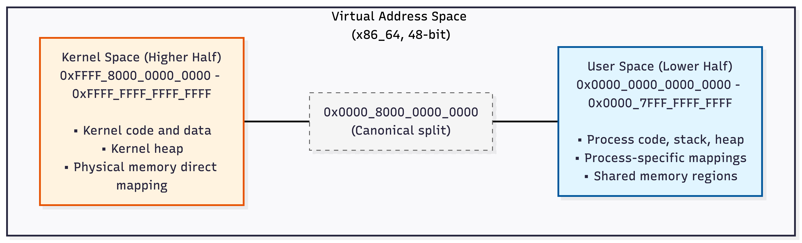

# Ferrous Kernel - Memory Management Architecture

**Version:** 0.1  
**Date:** 2026-01-04  
**Status:** Design Phase (Phase 0)

---

## Overview

This document describes the memory management architecture for Ferrous Kernel. Memory management is a foundational subsystem that provides physical and virtual memory allocation, page table management, and address space isolation.

**Related Documents:**
- [ARCHITECTURE.md](ARCHITECTURE.md) - System architecture overview
- [CHARTER.md](CHARTER.md) - Design principles and goals
- [ROADMAP.md](ROADMAP.md) - Development phases

---

## Design Goals

### Primary Goals

1. **Memory Safety** - Rust's ownership system prevents use-after-free and double-free
2. **Isolation** - Strong address space isolation between processes
3. **Performance** - Efficient allocation with NUMA awareness
4. **Correctness** - Clear ownership semantics, explicit lifetime management

### Constraints

- Must work in `no_std` environment
- Unsafe code must be minimal and isolated
- All unsafe operations require safety comments
- Page table modifications are inherently unsafe but wrapped in safe APIs

---

## Architecture Overview

Ferrous uses a **higher-half kernel** design with separate kernel and user address spaces:



### Key Design Decisions

1. **Higher-Half Kernel**: Kernel at high virtual addresses (0xFFFF_8000_0000_0000+)
   - Prevents user-space from accessing kernel memory
   - Simplifies kernel memory management
   - Standard design for modern kernels

2. **Per-Process Address Spaces**: Each process has independent page tables
   - Hardware MMU enforces isolation
   - Processes cannot access each other's memory
   - Clear ownership boundaries

3. **NUMA-Aware Allocation**: Physical memory allocation considers NUMA topology
   - Allocate from local NUMA node when possible
   - Reduce remote memory access latency
   - Improve performance on multi-socket systems

---

## Core Abstractions

### Physical Memory

#### PhysicalFrame

A physical memory frame (4KB page on x86_64). Physical frames are allocated from a global frame allocator.

**Key Properties**:
- Owned type (RAII) - automatically freed when dropped
- Cannot be cloned or copied (unique ownership)
- Frame number (PFN) is the identifier
- All frame operations are unsafe (raw pointer manipulation)

**Rust Interface (conceptual)**:
```rust
pub struct PhysicalFrame {
    pfn: PhysicalFrameNumber,
    // ...
}

impl PhysicalFrame {
    /// Allocate a new physical frame
    pub fn allocate() -> Option<Self> { /* ... */ }
    
    /// Get the frame number
    pub fn pfn(&self) -> PhysicalFrameNumber { /* ... */ }
    
    /// Get physical address
    pub fn start_address(&self) -> PhysicalAddress { /* ... */ }
}

// Automatic deallocation via Drop trait
impl Drop for PhysicalFrame {
    fn drop(&mut self) {
        // Return frame to allocator
    }
}
```

#### PhysicalFrameAllocator

Manages allocation and deallocation of physical frames.

**Allocation Strategy Options**:
- **Buddy Allocator**: Good for power-of-2 allocations, moderate fragmentation
- **Bitmap Allocator**: Simple, predictable, good for small systems
- **Slab Allocator**: Efficient for fixed-size allocations

**Phase 1 Decision**: Start with bitmap allocator for simplicity, migrate to buddy allocator if needed.

**NUMA Support**:
- Allocator maintains per-NUMA-node free lists
- Allocation prefers local NUMA node
- Fallback to remote nodes if local is exhausted

**Rust Interface (conceptual)**:
```rust
pub struct PhysicalFrameAllocator {
    // Per-NUMA-node allocators
    nodes: Vec<NodeAllocator>,
    // ...
}

impl PhysicalFrameAllocator {
    /// Initialize from UEFI memory map
    pub fn from_uefi_memory_map(map: &MemoryMap) -> Result<Self, MemoryError> {
        // Parse memory map, mark reserved regions
        // Initialize per-node allocators
    }
    
    /// Allocate a frame, preferring local NUMA node
    pub fn allocate_frame(&mut self) -> Option<PhysicalFrame> { /* ... */ }
    
    /// Allocate from specific NUMA node
    pub fn allocate_frame_from_node(&mut self, node: NumaNode) -> Option<PhysicalFrame> {
        /* ... */
    }
}
```

### Virtual Memory

#### VirtualAddress and PhysicalAddress

Type-safe address types to prevent mixing virtual and physical addresses.

```rust
#[derive(Debug, Clone, Copy, PartialEq, Eq, PartialOrd, Ord)]
pub struct VirtualAddress(u64);

#[derive(Debug, Clone, Copy, PartialEq, Eq, PartialOrd, Ord)]
pub struct PhysicalAddress(u64);

impl VirtualAddress {
    pub fn new(addr: u64) -> Option<Self> {
        // Validate canonical form on x86_64
        if Self::is_canonical(addr) {
            Some(Self(addr))
        } else {
            None
        }
    }
    
    fn is_canonical(addr: u64) -> bool {
        // x86_64 canonical address check
        (addr & 0xFFFF_8000_0000_0000) == 0x0000_0000_0000_0000 ||
        (addr & 0xFFFF_8000_0000_0000) == 0xFFFF_8000_0000_0000
    }
}
```

#### PageTable

Hardware page table management (x86_64 4-level page tables).

**Safety Considerations**:
- Page table manipulation is unsafe (raw pointer dereference)
- Wrapped in safe API with clear ownership
- All modifications require explicit safety guarantees

**Structure** (x86_64):
- 4 levels: PML4 → PDPT → PD → PT
- Each level has 512 entries (9 bits)
- Page size: 4KB (standard), 2MB/1GB (huge pages future)

**Rust Interface (conceptual)**:
```rust
pub struct PageTable {
    pml4_frame: PhysicalFrame,
    // ...
}

impl PageTable {
    /// Create new empty page table
    pub fn new() -> Result<Self, MemoryError> {
        // Allocate PML4 frame
        // Zero-initialize
    }
    
    /// Map a virtual page to a physical frame
    /// 
    /// # Safety
    /// - `virt_addr` must be a valid virtual address
    /// - `phys_frame` must be a valid physical frame
    /// - Mapping must not conflict with existing mappings
    pub unsafe fn map_page(
        &mut self,
        virt_addr: VirtualAddress,
        phys_frame: PhysicalFrame,
        flags: PageFlags,
    ) -> Result<(), MemoryError> {
        // Walk page table hierarchy
        // Create entries if needed
        // Set mapping and flags
    }
    
    /// Unmap a virtual page
    pub fn unmap_page(&mut self, virt_addr: VirtualAddress) -> Result<(), MemoryError> {
        // Walk page table to entry
        // Clear entry
        // Invalidate TLB
    }
    
    /// Translate virtual address to physical address
    pub fn translate(&self, virt_addr: VirtualAddress) -> Option<PhysicalAddress> {
        // Walk page table
        // Return physical address if mapped
    }
}
```

#### AddressSpace

Per-process virtual address space with its own page table.

**Key Properties**:
- Each process has one AddressSpace
- Owns its PageTable
- Manages virtual memory regions
- Isolated from other address spaces

**Rust Interface (conceptual)**:
```rust
pub struct AddressSpace {
    page_table: PageTable,
    regions: Vec<VirtualRegion>,
    // ...
}

impl AddressSpace {
    /// Create new empty address space
    pub fn new() -> Result<Self, MemoryError> { /* ... */ }
    
    /// Map a virtual region to physical frames
    pub fn map_region(
        &mut self,
        virt_start: VirtualAddress,
        size: usize,
        flags: PageFlags,
    ) -> Result<VirtualRegion, MemoryError> {
        // Allocate physical frames
        // Create page table mappings
        // Track region
    }
    
    /// Unmap a virtual region
    pub fn unmap_region(&mut self, region: VirtualRegion) -> Result<(), MemoryError> {
        // Unmap all pages in region
        // Free physical frames
        // Remove region tracking
    }
    
    /// Get the page table (for context switching)
    pub fn page_table(&self) -> &PageTable { /* ... */ }
}
```

#### VirtualRegion

Represents a contiguous virtual memory region (heap, stack, mapped file, etc.).

**Types of Regions**:
- **Code**: Executable, read-only (text segment)
- **Data**: Read-write (data segment, BSS)
- **Stack**: Read-write, grows downward
- **Heap**: Read-write, grows upward
- **Mapped**: Memory-mapped file or shared memory

**Rust Interface (conceptual)**:
```rust
pub struct VirtualRegion {
    start: VirtualAddress,
    size: usize,
    flags: RegionFlags,
    frames: Vec<PhysicalFrame>, // Owned physical frames
    // ...
}

#[derive(Debug, Clone, Copy)]
pub struct RegionFlags {
    pub read: bool,
    pub write: bool,
    pub execute: bool,
    pub user: bool, // User-space accessible
    pub shared: bool, // Shared between processes
}
```

---

## Memory Allocation Strategies

### Kernel Heap Allocator

Global kernel heap for dynamic allocation (similar to `malloc`/`free`).

**Design Considerations**:
- Must work in `no_std` (implement `GlobalAlloc` trait)
- Thread-safe (multiple cores accessing kernel heap)
- Reasonable performance (not a bottleneck)
- Clear failure modes (return `None` on OOM)

**Implementation Options**:
- **Linked List Allocator**: Simple but fragmented
- **Fixed-Size Block Allocator**: Fast, limited flexibility
- **Buddy Allocator**: Good balance (recommended)

**Phase 1 Approach**: Start with simple linked list allocator, migrate to buddy allocator.

**Rust Interface**:
```rust
// Implement GlobalAlloc for kernel heap
pub struct KernelAllocator {
    // ...
}

unsafe impl GlobalAlloc for KernelAllocator {
    unsafe fn alloc(&self, layout: Layout) -> *mut u8 {
        // Allocate memory
    }
    
    unsafe fn dealloc(&self, ptr: *mut u8, layout: Layout) {
        // Free memory
    }
}

#[global_allocator]
static ALLOCATOR: KernelAllocator = KernelAllocator::new();
```

### User-Space Heap

Process heap management (future, Phase 2+).

- Managed by user-space code (libc equivalent)
- Kernel provides `brk`/`sbrk`-like syscall (or more modern alternative)
- Kernel enforces memory limits via capabilities

---

## Page Table Management

### x86_64 Page Tables

**Structure**:
```
PML4 (Page Map Level 4) - 512 entries
  └─ PDPT (Page Directory Pointer Table) - 512 entries
      └─ PD (Page Directory) - 512 entries
          └─ PT (Page Table) - 512 entries
              └─ 4KB Page
```

**Flags** (standard x86_64):
- `P` (Present): Page is mapped
- `R/W` (Read/Write): Write permission
- `U/S` (User/Supervisor): User-space accessible
- `PWT` (Page Write Through): Write-through caching
- `PCD` (Page Cache Disable): Cache disable
- `A` (Accessed): Page has been accessed
- `D` (Dirty): Page has been written
- `PS` (Page Size): Large page (2MB/1GB)
- `NX` (No Execute): Execution disabled (security)

### Safety Guarantees

**Unsafe Operations**:
- Direct page table pointer dereference
- MMU register manipulation (CR3, CR4)
- TLB invalidation

**Safe Wrappers**:
- `PageTable::map_page()` - Validates addresses, checks conflicts
- `PageTable::unmap_page()` - Ensures page is mapped
- `AddressSpace` - Owns page table, prevents double-free

**Safety Comments Required**:
Every unsafe block modifying page tables must document:
- What invariants must hold
- Why they are guaranteed
- What could go wrong if violated

---

## Address Space Isolation

### Kernel Address Space

**Kernel Mappings**:
- Identity mapping for physical memory (direct access)
- Kernel code and data sections
- Kernel heap
- Device memory (MMIO)
- Per-CPU data structures

**Security Properties**:
- Kernel memory not accessible from user-space (U/S bit)
- Kernel code not executable from user-space
- No user-space → kernel transitions except via syscalls

### User Address Space

**Process Mappings**:
- Code segment (executable, read-only)
- Data segment (read-write)
- Stack (grows downward)
- Heap (grows upward)
- Shared libraries (future)
- Memory-mapped files (future)

**Isolation Guarantees**:
- Each process has independent page tables
- Processes cannot access each other's memory
- Hardware MMU enforces isolation
- Shared memory is explicit (capability-controlled)

### Context Switching

**Page Table Switch**:
1. Save current page table (if needed)
2. Load new process's page table (CR3 register)
3. Invalidate TLB (or use PCID if available)

**Performance Considerations**:
- TLB flush is expensive (use PCID if available)
- Lazy TLB invalidation (flush on actual access)
- Per-CPU TLB state tracking

---

## NUMA Awareness

### NUMA Topology

**Detection**:
- Parse ACPI SRAT (System Resource Affinity Table) at boot
- Build NUMA node topology
- Map physical memory to NUMA nodes

**Allocation Strategy**:
- Prefer local NUMA node for allocations
- Fallback to remote nodes if local is exhausted
- Track allocation statistics per node

**Scheduler Integration** (future):
- Schedule tasks on CPUs close to their memory
- Migrate pages if task moves to different NUMA node
- Consider NUMA distance in allocation decisions

---

## Memory Safety

### Rust Ownership Model

**Key Benefits**:
- Prevents use-after-free (compile-time guarantee)
- Prevents double-free (single owner)
- Prevents data races (borrow checker)
- Clear lifetime semantics

**PhysicalFrame Ownership**:
- `PhysicalFrame` is owned (cannot be cloned)
- Dropping a `PhysicalFrame` returns it to allocator
- Moving frames between address spaces transfers ownership

**PageTable Ownership**:
- `AddressSpace` owns its `PageTable`
- Page table cannot be shared between processes
- Dropping `AddressSpace` unmaps all pages

### Unsafe Code Boundaries

**Unsafe Operations**:
1. **Physical frame allocation/deallocation**
   - Raw pointer manipulation
   - Frame allocator internal state
   - **Safety**: Allocator maintains valid free list

2. **Page table manipulation**
   - Direct pointer dereference
   - MMU register access (CR3)
   - **Safety**: Page table structure is valid, addresses are canonical

3. **TLB invalidation**
   - CPU-specific instructions (INVLPG)
   - **Safety**: Virtual address is valid

**Safe Abstractions**:
- `AddressSpace::map_region()` - Safe API wrapping unsafe page table ops
- `PhysicalFrameAllocator::allocate_frame()` - Safe API wrapping unsafe allocator
- Type system prevents mixing virtual/physical addresses

---

## Error Handling

### Memory Errors

**Error Types**:
```rust
#[derive(Debug)]
pub enum MemoryError {
    OutOfMemory,
    InvalidAddress,
    AlreadyMapped,
    NotMapped,
    InvalidFlags,
    NumaNodeNotFound,
}
```

**Error Handling Philosophy**:
- Explicit errors (no silent failures)
- Panic on kernel memory exhaustion (kernel bug)
- Return errors for user-space operations
- Observability events for all errors

---

## Observability

### Memory Events

**Event Types**:
- **Frame Allocation**: Frame allocated, NUMA node, requester
- **Frame Deallocation**: Frame freed, duration held
- **Page Map**: Virtual page mapped, physical frame, flags
- **Page Unmap**: Virtual page unmapped
- **Page Fault**: Fault address, fault type, resolution
- **Memory Pressure**: Low memory condition, recovery action

**Causality Tracking**:
- Link memory operations to syscalls
- Track memory allocation chains
- Attribute memory usage to processes/resource groups

---

## Boot-Time Memory Setup

### Early Boot Sequence

1. **Parse UEFI Memory Map**
   - Identify usable memory regions
   - Mark reserved regions (ACPI tables, bootloader data)
   - Detect NUMA topology

2. **Initialize Physical Frame Allocator**
   - Build free frame list from memory map
   - Reserve frames for kernel code/data
   - Initialize per-NUMA-node allocators

3. **Set Up Kernel Page Tables**
   - Identity map physical memory (temporary)
   - Map kernel code/data sections
   - Enable paging (CR0.PG = 1)

4. **Switch to Higher-Half Kernel**
   - Remap kernel to high virtual addresses
   - Remove low-memory identity mapping
   - Update all kernel pointers

5. **Initialize Kernel Heap**
   - Allocate initial heap frames
   - Set up allocator data structures
   - Enable global allocator

---

## Implementation Phases

### Phase 1: Foundation

**Deliverables**:
- Physical frame allocator (bitmap)
- Basic page table management (4KB pages only)
- Kernel heap allocator (simple linked list)
- Address space creation/destruction
- Higher-half kernel setup

**Success Criteria**:
- Kernel can allocate/free physical frames
- Kernel can create page tables and map pages
- Kernel heap allocation works
- Boot completes with paging enabled

### Phase 2: Process Memory

**Deliverables**:
- Per-process address spaces
- User-space memory mapping syscalls
- Stack and heap setup for processes
- Memory-mapped regions

**Success Criteria**:
- Processes have isolated address spaces
- User-space can allocate memory
- Memory isolation is enforced

### Phase 3: Advanced Features

**Deliverables**:
- Huge pages (2MB/1GB) support
- Shared memory regions
- Memory-mapped files
- Copy-on-write (COW) pages
- Memory pressure handling

---

## Future Considerations

### Potential Enhancements

1. **Huge Pages**: 2MB and 1GB pages for better TLB coverage
2. **Transparent Huge Pages**: Automatic promotion of 4KB pages
3. **Memory Compression**: Compress rarely-used pages
4. **Memory Overcommit**: Overcommit memory with swap (future)
5. **Page Migration**: Move pages between NUMA nodes
6. **Memory Encryption**: Encrypt pages at rest (confidential computing)

---

## Related Documents

- [ARCHITECTURE.md](ARCHITECTURE.md) - System architecture overview
- [BOOT_ARCHITECTURE.md](BOOT_ARCHITECTURE.md) - Boot process and initialization
- [CAPABILITY_SYSTEM.md](CAPABILITY_SYSTEM.md) - Capability-based security (memory access control)

---

**Document Status**: This is a living document. As implementation progresses, details will be refined and documented in ADRs.

