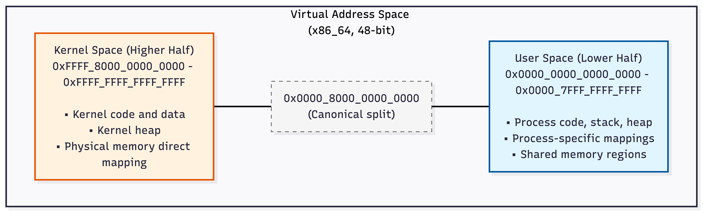

# Ferrous Kernel - Memory Management Architecture

**Version:** 0.5
**Date:** 2026-05-02
**Status:** Phase 1 In Progress (1.3.1–1.3.4 complete, 1.3.5 pending)

---

## Overview

This document describes the memory management architecture for Ferrous Kernel. Memory management is a foundational subsystem that provides physical and virtual memory allocation, page table management, and address space isolation.

**Related Documents:**
- [ARCHITECTURE.md](ARCHITECTURE.md) - System architecture overview
- [CHARTER.md](CHARTER.md) - Design principles and goals
- [ROADMAP.md](ROADMAP.md) - Development phases

---

## Design Goals

### Primary Goals

1. **Memory Safety** - Rust's ownership system prevents use-after-free and double-free
2. **Isolation** - Strong address space isolation between processes
3. **Performance** - Efficient allocation with NUMA awareness
4. **Correctness** - Clear ownership semantics, explicit lifetime management

### Constraints

- Must work in `no_std` environment
- Unsafe code must be minimal and isolated
- All unsafe operations require safety comments
- Page table modifications are inherently unsafe but wrapped in safe APIs

---

## Architecture Overview

Ferrous uses a **higher-half kernel** design with separate kernel and user address spaces:



### Key Design Decisions

1. **Higher-Half Kernel**: Kernel at high virtual addresses (0xFFFF_8000_0000_0000+)
   - Prevents user-space from accessing kernel memory
   - Simplifies kernel memory management
   - Standard design for modern kernels

2. **Per-Process Address Spaces**: Each process has independent page tables
   - Hardware MMU enforces isolation
   - Processes cannot access each other's memory
   - Clear ownership boundaries

3. **NUMA-Aware Allocation**: Physical memory allocation considers NUMA topology
   - Allocate from local NUMA node when possible
   - Reduce remote memory access latency
   - Improve performance on multi-socket systems

---

## Core Abstractions

### Physical Memory

#### PhysFrame

A physical memory frame handle (4 KiB page on x86_64), implemented in `ferrous-boot-info` so it can be unit-tested on the host.

**Key Properties**:
- Wraps a physical frame number (PFN): `start_address == pfn * 4096`
- `Copy` in Phase 1 — no `Drop`/RAII because implementing `Drop` with automatic deallocation would create a circular dependency (`ferrous-boot-info` cannot call into `kernel`). Phase 2 will remove `Copy` and add `Drop`-based deallocation once the kernel crate has its own test infrastructure.
- Constructors validate alignment; `from_pfn` is `#[doc(hidden)]` (allocator-internal use only)

**Actual API** (`ferrous-boot-info::PhysFrame`):
```rust
pub const PAGE_SIZE: u64 = 4096;

#[derive(Debug, Clone, Copy, PartialEq, Eq, PartialOrd, Ord)]
pub struct PhysFrame(u64); // inner = PFN

impl PhysFrame {
    pub fn from_addr(phys_addr: u64) -> Option<Self>; // None if not 4 KiB aligned
    pub fn pfn(self) -> u64;
    pub fn start_address(self) -> u64; // pfn * PAGE_SIZE
    pub fn end_address(self) -> u64;   // (pfn + 1) * PAGE_SIZE
}
```

#### BitmapFrameAllocator

Phase 1 physical frame allocator. Tracks frame availability with a fixed-size bitmap stored entirely in BSS.

**Design decisions**:
- **Bitmap allocator** chosen for Phase 1: simple, predictable, O(WORDS) worst-case, O(1) amortised with hint
- **Bit 1 = free, bit 0 = reserved/allocated** — BSS zero-init safely means "all frames reserved" before `init_from_memory_map` runs
- **`const fn new()` returns all-zeros** — 2 MiB static lands in BSS, not the data segment; zero binary bloat
- **Const-generic `WORDS`** — small test instances in `ferrous-boot-info` unit tests; 2 MiB production instance in `kernel`
- **First-fit with word-level hint** — `next_hint` word index skips already-exhausted words; sequential allocations are O(1) in practice
- Phase 1 allocates **only from immediately-usable (conventional) regions**; reclaimable regions (bootloader, ACPI) reclaimed in Phase 2+
- **No internal synchronisation** — Phase 1 is single-core with interrupts disabled during all allocator calls; Phase 2 adds spinlock

**Actual API** (`ferrous-boot-info::BitmapFrameAllocator<const WORDS: usize>`):
```rust
pub const KERNEL_BITMAP_WORDS: usize = 262_144; // supports 64 GiB

pub struct BitmapFrameAllocator<const WORDS: usize> { /* bitmap + metadata */ }

impl<const WORDS: usize> BitmapFrameAllocator<WORDS> {
    pub const fn new() -> Self;                              // all-zeros, BSS-safe
    pub fn init_from_memory_map(&mut self, map: &MemoryMap); // mark usable frames free
    pub fn mark_reserved(&mut self, phys_start: u64, size_bytes: u64);
    pub fn allocate(&mut self) -> Option<PhysFrame>;         // first-fit with hint
    pub fn deallocate(&mut self, frame: PhysFrame);          // double-free detected in debug
    pub fn free_frames(&self) -> usize;
    pub fn total_frames(&self) -> usize;                     // WORDS * 64
    pub fn allocated_frames(&self) -> usize;
}
```

**Global kernel instance** (`kernel::memory::frame_allocator`):
```rust
// 2 MiB in BSS — zero binary overhead.
static mut ALLOCATOR: BitmapFrameAllocator<KERNEL_BITMAP_WORDS> = BitmapFrameAllocator::new();
static INITIALIZED: AtomicBool = AtomicBool::new(false);

// Public API (unsafe — callers guarantee single-threaded access in Phase 1):
pub unsafe fn init(map: &MemoryMap);
pub unsafe fn allocate() -> Option<PhysFrame>;
pub unsafe fn deallocate(frame: PhysFrame);
pub unsafe fn mark_reserved(phys_start: u64, size_bytes: u64);

// Safe stat queries:
pub fn free_frames() -> Option<usize>;
pub fn total_frames() -> Option<usize>;
pub fn allocated_frames() -> Option<usize>;
```

**QEMU measurements** (Phase 1.3.2, PR #87):
- 52,311 free frames (204 MiB immediately usable)
- 16,777,216 total addressable frames (64 GiB bitmap capacity)
- Smoke test: 3 allocations returned distinct, 4 KiB-aligned addresses; deallocation restored count

**NUMA Support** (Phase 2+):
- Phase 1 uses a single global bitmap
- Phase 2+ will parse ACPI SRAT to build per-NUMA-node allocators
- Allocation will prefer the local NUMA node with fallback to remote nodes

### Virtual Memory

#### VirtualAddress and PhysicalAddress

Type-safe address types to prevent mixing virtual and physical addresses.

```rust
#[derive(Debug, Clone, Copy, PartialEq, Eq, PartialOrd, Ord)]
pub struct VirtualAddress(u64);

#[derive(Debug, Clone, Copy, PartialEq, Eq, PartialOrd, Ord)]
pub struct PhysicalAddress(u64);

impl VirtualAddress {
    pub fn new(addr: u64) -> Option<Self> {
        // Validate canonical form on x86_64
        if Self::is_canonical(addr) {
            Some(Self(addr))
        } else {
            None
        }
    }
    
    fn is_canonical(addr: u64) -> bool {
        // x86_64 canonical address check
        (addr & 0xFFFF_8000_0000_0000) == 0x0000_0000_0000_0000 ||
        (addr & 0xFFFF_8000_0000_0000) == 0xFFFF_8000_0000_0000
    }
}
```

#### PageTable

Hardware page table management (x86_64 4-level page tables).

**Safety Considerations**:
- Page table manipulation is unsafe (raw pointer dereference)
- Wrapped in safe API with clear ownership
- All modifications require explicit safety guarantees

**Structure** (x86_64):
- 4 levels: PML4 → PDPT → PD → PT
- Each level has 512 entries (9 bits)
- Page size: 4KB (standard), 2MB/1GB (huge pages future)

**Rust Interface (conceptual)**:
```rust
pub struct PageTable {
    pml4_frame: PhysicalFrame,
    // ...
}

impl PageTable {
    /// Create new empty page table
    pub fn new() -> Result<Self, MemoryError> {
        // Allocate PML4 frame
        // Zero-initialize
    }
    
    /// Map a virtual page to a physical frame
    /// 
    /// # Safety
    /// - `virt_addr` must be a valid virtual address
    /// - `phys_frame` must be a valid physical frame
    /// - Mapping must not conflict with existing mappings
    pub unsafe fn map_page(
        &mut self,
        virt_addr: VirtualAddress,
        phys_frame: PhysicalFrame,
        flags: PageFlags,
    ) -> Result<(), MemoryError> {
        // Walk page table hierarchy
        // Create entries if needed
        // Set mapping and flags
    }
    
    /// Unmap a virtual page
    pub fn unmap_page(&mut self, virt_addr: VirtualAddress) -> Result<(), MemoryError> {
        // Walk page table to entry
        // Clear entry
        // Invalidate TLB
    }
    
    /// Translate virtual address to physical address
    pub fn translate(&self, virt_addr: VirtualAddress) -> Option<PhysicalAddress> {
        // Walk page table
        // Return physical address if mapped
    }
}
```

#### AddressSpace

Per-process virtual address space with its own page table.

**Key Properties**:
- Each process has one AddressSpace
- Owns its PageTable
- Manages virtual memory regions
- Isolated from other address spaces

**Rust Interface (conceptual)**:
```rust
pub struct AddressSpace {
    page_table: PageTable,
    regions: Vec<VirtualRegion>,
    // ...
}

impl AddressSpace {
    /// Create new empty address space
    pub fn new() -> Result<Self, MemoryError> { /* ... */ }
    
    /// Map a virtual region to physical frames
    pub fn map_region(
        &mut self,
        virt_start: VirtualAddress,
        size: usize,
        flags: PageFlags,
    ) -> Result<VirtualRegion, MemoryError> {
        // Allocate physical frames
        // Create page table mappings
        // Track region
    }
    
    /// Unmap a virtual region
    pub fn unmap_region(&mut self, region: VirtualRegion) -> Result<(), MemoryError> {
        // Unmap all pages in region
        // Free physical frames
        // Remove region tracking
    }
    
    /// Get the page table (for context switching)
    pub fn page_table(&self) -> &PageTable { /* ... */ }
}
```

#### VirtualRegion

Represents a contiguous virtual memory region (heap, stack, mapped file, etc.).

**Types of Regions**:
- **Code**: Executable, read-only (text segment)
- **Data**: Read-write (data segment, BSS)
- **Stack**: Read-write, grows downward
- **Heap**: Read-write, grows upward
- **Mapped**: Memory-mapped file or shared memory

**Rust Interface (conceptual)**:
```rust
pub struct VirtualRegion {
    start: VirtualAddress,
    size: usize,
    flags: RegionFlags,
    frames: Vec<PhysicalFrame>, // Owned physical frames
    // ...
}

#[derive(Debug, Clone, Copy)]
pub struct RegionFlags {
    pub read: bool,
    pub write: bool,
    pub execute: bool,
    pub user: bool, // User-space accessible
    pub shared: bool, // Shared between processes
}
```

---

## Memory Allocation Strategies

### Kernel Heap Allocator

Global kernel heap for dynamic allocation (similar to `malloc`/`free`).

**Design Considerations**:
- Must work in `no_std` (implement `GlobalAlloc` trait)
- Thread-safe (multiple cores accessing kernel heap)
- Reasonable performance (not a bottleneck)
- Clear failure modes (return `None` on OOM)

**Implementation Options**:
- **Linked List Allocator**: Simple but fragmented
- **Fixed-Size Block Allocator**: Fast, limited flexibility
- **Buddy Allocator**: Good balance (recommended)

**Phase 1 Approach**: Start with simple linked list allocator, migrate to buddy allocator.

**Rust Interface**:
```rust
// Implement GlobalAlloc for kernel heap
pub struct KernelAllocator {
    // ...
}

unsafe impl GlobalAlloc for KernelAllocator {
    unsafe fn alloc(&self, layout: Layout) -> *mut u8 {
        // Allocate memory
    }
    
    unsafe fn dealloc(&self, ptr: *mut u8, layout: Layout) {
        // Free memory
    }
}

#[global_allocator]
static ALLOCATOR: KernelAllocator = KernelAllocator::new();
```

### User-Space Heap

Process heap management (future, Phase 2+).

- Managed by user-space code (libc equivalent)
- Kernel provides `brk`/`sbrk`-like syscall (or more modern alternative)
- Kernel enforces memory limits via capabilities

---

## Page Table Management

### x86_64 Page Tables

**Structure**:
```
PML4 (Page Map Level 4) - 512 entries
  └─ PDPT (Page Directory Pointer Table) - 512 entries
      └─ PD (Page Directory) - 512 entries
          └─ PT (Page Table) - 512 entries
              └─ 4KB Page
```

**Flags** (standard x86_64):
- `P` (Present): Page is mapped
- `R/W` (Read/Write): Write permission
- `U/S` (User/Supervisor): User-space accessible
- `PWT` (Page Write Through): Write-through caching
- `PCD` (Page Cache Disable): Cache disable
- `A` (Accessed): Page has been accessed
- `D` (Dirty): Page has been written
- `PS` (Page Size): Large page (2MB/1GB)
- `NX` (No Execute): Execution disabled (security)

### Safety Guarantees

**Unsafe Operations**:
- Direct page table pointer dereference
- MMU register manipulation (CR3, CR4)
- TLB invalidation

**Safe Wrappers**:
- `PageTable::map_page()` - Validates addresses, checks conflicts
- `PageTable::unmap_page()` - Ensures page is mapped
- `AddressSpace` - Owns page table, prevents double-free

**Safety Comments Required**:
Every unsafe block modifying page tables must document:
- What invariants must hold
- Why they are guaranteed
- What could go wrong if violated

---

## Address Space Isolation

### Kernel Address Space

**Kernel Mappings**:
- Identity mapping for physical memory (direct access)
- Kernel code and data sections
- Kernel heap
- Device memory (MMIO)
- Per-CPU data structures

**Security Properties**:
- Kernel memory not accessible from user-space (U/S bit)
- Kernel code not executable from user-space
- No user-space → kernel transitions except via syscalls

### User Address Space

**Process Mappings**:
- Code segment (executable, read-only)
- Data segment (read-write)
- Stack (grows downward)
- Heap (grows upward)
- Shared libraries (future)
- Memory-mapped files (future)

**Isolation Guarantees**:
- Each process has independent page tables
- Processes cannot access each other's memory
- Hardware MMU enforces isolation
- Shared memory is explicit (capability-controlled)

### Context Switching

**Page Table Switch**:
1. Save current page table (if needed)
2. Load new process's page table (CR3 register)
3. Invalidate TLB (or use PCID if available)

**Performance Considerations**:
- TLB flush is expensive (use PCID if available)
- Lazy TLB invalidation (flush on actual access)
- Per-CPU TLB state tracking

---

## NUMA Awareness

### NUMA Topology

**Detection**:
- Parse ACPI SRAT (System Resource Affinity Table) at boot
- Build NUMA node topology
- Map physical memory to NUMA nodes

**Allocation Strategy**:
- Prefer local NUMA node for allocations
- Fallback to remote nodes if local is exhausted
- Track allocation statistics per node

**Scheduler Integration** (future):
- Schedule tasks on CPUs close to their memory
- Migrate pages if task moves to different NUMA node
- Consider NUMA distance in allocation decisions

---

## Memory Safety

### Rust Ownership Model

**Key Benefits**:
- Prevents use-after-free (compile-time guarantee)
- Prevents double-free (single owner)
- Prevents data races (borrow checker)
- Clear lifetime semantics

**PhysFrame Ownership (Phase 1)**:
- `PhysFrame` is `Copy` in Phase 1 — no `Drop` because `ferrous-boot-info` cannot call into `kernel`
- Callers explicitly invoke `frame_allocator::deallocate(frame)` when done
- Phase 2 removes `Copy` and adds `Drop`-based automatic deallocation once the allocator moves into the kernel crate

**PageTable Ownership**:
- `AddressSpace` owns its `PageTable`
- Page table cannot be shared between processes
- Dropping `AddressSpace` unmaps all pages

### Unsafe Code Boundaries

**Unsafe Operations**:
1. **Physical frame allocation/deallocation**
   - Raw pointer manipulation
   - Frame allocator internal state
   - **Safety**: Allocator maintains valid free list

2. **Page table manipulation**
   - Direct pointer dereference
   - MMU register access (CR3)
   - **Safety**: Page table structure is valid, addresses are canonical

3. **TLB invalidation**
   - CPU-specific instructions (INVLPG)
   - **Safety**: Virtual address is valid

**Safe Abstractions**:
- `AddressSpace::map_region()` - Safe API wrapping unsafe page table ops
- `PhysicalFrameAllocator::allocate_frame()` - Safe API wrapping unsafe allocator
- Type system prevents mixing virtual/physical addresses

---

## Error Handling

### Memory Errors

**Error Types**:
```rust
#[derive(Debug)]
pub enum MemoryError {
    OutOfMemory,
    InvalidAddress,
    AlreadyMapped,
    NotMapped,
    InvalidFlags,
    NumaNodeNotFound,
}
```

**Error Handling Philosophy**:
- Explicit errors (no silent failures)
- Panic on kernel memory exhaustion (kernel bug)
- Return errors for user-space operations
- Observability events for all errors

---

## Observability

### Memory Events

**Event Types**:
- **Frame Allocation**: Frame allocated, NUMA node, requester
- **Frame Deallocation**: Frame freed, duration held
- **Page Map**: Virtual page mapped, physical frame, flags
- **Page Unmap**: Virtual page unmapped
- **Page Fault**: Fault address, fault type, resolution
- **Memory Pressure**: Low memory condition, recovery action

**Causality Tracking**:
- Link memory operations to syscalls
- Track memory allocation chains
- Attribute memory usage to processes/resource groups

---

## Boot-Time Memory Setup

### Early Boot Sequence

1. **Parse UEFI Memory Map** -- COMPLETE (Phase 1.3.1, PR #64)
   - `MemoryMap::parse(&KernelMemoryMap)` validates and copies all descriptors
   - `MemoryRegionKind` classifies each region: `Usable`, `BootloaderReclaimable`, `AcpiReclaimable`, `FirmwareRuntime`, `Mmio`, `Reserved`, etc.
   - `MemoryStats` caches total/usable/reclaimable byte counts computed in one pass
   - Global instance stored via `kernel::memory::init()` / `kernel::memory::get()` using `MaybeUninit` + `AtomicBool`
   - Full region table printed to serial on every boot

2. **Initialize Physical Frame Allocator** -- COMPLETE (Phase 1.3.2, PR #87)
   - `PhysFrame` and `BitmapFrameAllocator<const WORDS>` implemented in `ferrous-boot-info` (host-testable); 25 new unit tests (70 total)
   - `kernel::memory::frame_allocator` holds a 2 MiB `static mut BitmapFrameAllocator<262144>` in BSS (zero binary bloat)
   - `init_from_memory_map` marks immediately-usable (conventional) regions free; reclaimable regions remain reserved until Phase 2+ reclamation pass
   - Phase 1 threading: single-core, interrupts disabled; `unsafe` API; Phase 2 adds spinlock
   - QEMU boot output confirms 52,311 free frames / 204 MiB usable; 3-frame smoke test passes

3. **Set Up Kernel Page Tables** -- COMPLETE (Phase 1.3.3, PR #88)
   - `kernel::memory::paging` added: `VirtualAddress` (canonical-form validated), `PhysicalAddress`, `PageTableEntry` + `flags` constants, `PageTable` ([PageTableEntry; 512], 4 KiB-aligned), `KernelPageTable` (Phase 1 mapper — PML4 + PDPT + PD inline)
   - Phase 1 uses **2 MiB huge pages** (PS=1 in PD entries): `PML4[0]→PDPT[0]→PD[0..511]` covers [0, 1 GiB) identity; `PML4[256]→PDPT` creates higher-half alias at `0xFFFF_8000_0000_0000`
   - Boot Step 7 (`setup_page_tables`) populates three raw 4 KiB BSS statics via raw pointer writes (`addr_of_mut!`), loads PML4 physical address into CR3 (`MOV CR3`)
   - CR3 readback verified; higher-half alias confirmed via `read_volatile` through `0xFFFF_8000_...` VA; QEMU boot verification passes

4. **Fine-Grained 4 KiB Page Mapping** -- COMPLETE (Phase 1.3.4, PR #TBD)
   - `FrameAllocate` trait in `kernel::memory::paging::mapper` decouples page-walker from specific allocator
   - `ActivePageTable` type provides `map_4k`, `unmap_4k`, `translate` over the live CR3 tables
   - `MapError` (`OutOfMemory`, `AlreadyMapped`, `HugePageConflict`) and `UnmapError` (`NotMapped`, `HugePage`) as typed results
   - `split_huge_pd` automatically splits a 2 MiB PD entry into 512 × 4 KiB PT entries when `map_4k` hits a huge-page on the walk path; full TLB flush via CR3 reload after split
   - `invlpg` (single-VA TLB invalidation after each map/unmap) and `flush_tlb_all` (CR3 reload for bulk splits)
   - Boot Step 8 smoke test: (A) translate identity-mapped VA; (B) map/unmap round-trip at unmapped PML4[1] VA; (C) huge-page split activates KERNEL_STACK guard page (4 KiB non-present); QEMU boot verification passes

5. **Switch to Higher-Half Kernel** -- Deferred to Phase 2
   - Phase 1 establishes the higher-half alias window but the kernel continues running at identity-mapped VAs (same binary, no linker-script VMA offset)
   - Full higher-half switch (kernel loaded at `0xFFFF_8000_0000_0000`, low identity map removed) happens when the kernel becomes a separate ELF binary in Phase 2

5. **Initialize Kernel Heap** -- Phase 1.3.5 (pending)
   - Allocate initial heap frames from physical allocator
   - Set up linked-list allocator (Phase 1); migrate to buddy allocator (Phase 2)
   - Enable `#[global_allocator]`

---

## Implementation Phases

### Phase 1: Foundation

**Deliverables**:

| Task | Status | Notes |
|------|--------|-------|
| UEFI memory map parsing | Complete (PR #64) | `MemoryMap`, `MemoryRegionKind`, `MemoryStats` in `ferrous-boot-info`; global `init`/`get` in `kernel::memory` |
| Physical frame allocator (bitmap) | Complete (PR #87) | `BitmapFrameAllocator<262144>` in `ferrous-boot-info`; 2 MiB BSS bitmap; 52,311 free frames on QEMU |
| Basic page table management (2 MiB huge pages) | Complete (PR #88) | `VirtualAddress`, `PhysicalAddress`, `PageTableEntry`, `PageTable`, `KernelPageTable`; identity + higher-half alias confirmed on QEMU |
| Fine-grained 4 KiB page mapping | Complete (PR #TBD) | `ActivePageTable` with `map_4k`/`unmap_4k`/`translate`; `FrameAllocate` trait; `split_huge_pd`; `invlpg` + `flush_tlb_all`; guard page activated in boot Step 8 |
| Kernel heap allocator (linked list) | Pending (1.3.5) | Implements `GlobalAlloc`; migrate to buddy in Phase 2 |
| Higher-half kernel binary (Phase 2) | Pending | Full ELF relocation to `0xFFFF_8000_0000_0000`; remove identity map |

**Success Criteria**:
- [x] UEFI memory map parsed, classified, and accessible to all kernel subsystems
- [x] Kernel can allocate and free physical frames
- [x] Kernel owns its page tables (replaced UEFI firmware tables with Ferrous tables at boot)
- [x] Higher-half window established at `0xFFFF_8000_0000_0000`
- [x] Kernel can map/unmap individual 4 KiB pages
- [ ] Kernel heap allocation works (`Box`, `Vec` available)
- [ ] Kernel binary loaded at higher-half VMA

### Phase 2: Process Memory

**Deliverables**:
- Per-process address spaces
- User-space memory mapping syscalls
- Stack and heap setup for processes
- Memory-mapped regions

**Success Criteria**:
- Processes have isolated address spaces
- User-space can allocate memory
- Memory isolation is enforced

### Phase 3: Advanced Features

**Deliverables**:
- Huge pages (2MB/1GB) support
- Shared memory regions
- Memory-mapped files
- Copy-on-write (COW) pages
- Memory pressure handling

---

## Future Considerations

### Potential Enhancements

1. **Huge Pages**: 2MB and 1GB pages for better TLB coverage
2. **Transparent Huge Pages**: Automatic promotion of 4KB pages
3. **Memory Compression**: Compress rarely-used pages
4. **Memory Overcommit**: Overcommit memory with swap (future)
5. **Page Migration**: Move pages between NUMA nodes
6. **Memory Encryption**: Encrypt pages at rest (confidential computing)

---

## Related Documents

- [ARCHITECTURE.md](ARCHITECTURE.md) - System architecture overview
- [BOOT_ARCHITECTURE.md](BOOT_ARCHITECTURE.md) - Boot process and initialization
- [CAPABILITY_SYSTEM.md](CAPABILITY_SYSTEM.md) - Capability-based security (memory access control)

---

**Document Status**: This is a living document. As implementation progresses, details will be refined and documented in ADRs.

